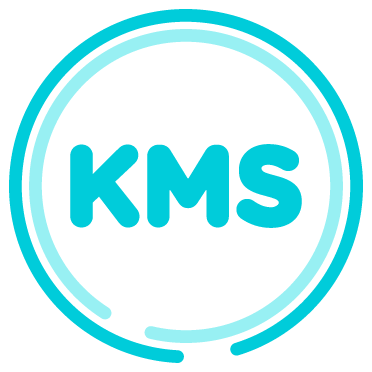

> :warning: Éste repositorio está **muerto**, y permanecerá aquí sin modificaciones sólo con propósito histórico.

  

La idea básica de KMS es tener una pulsera con una serie de sensores y que esta se comunique con nuestro smartphone
para enviar datos sobre distancia recorrida, calorías quemadas, horas de sueño, así como demás estadísticas para
mantener un control y una cuantificación de nuestras actividades físicas.

~ [Rodrigo Garrido (Xataka)](https://www.xataka.com.mx/accesorios/kms-en-mexico-tambien-se-prepara-una-pulsera-cuantificadora)

# KMS Interop
Estructuras de datos y algoritmos compartidos por todas las implementaciones .NET del Cliente de KMS. El _target_
de compilación deliveradamente era .NET Portable (actualmente _.NET Portable Subset (Legacy)_).

La idea era utilizar ésta libreria en las otras versiones del Cliente de KMS Desktop para plataformas como
Windows Phone, o Mac OS y Linux (vaya locura) que serían creadas a partir de KMS Cloud para Windows aprovechando
el progreso tan importante del Mono runtime.

Ésta librería era la encargada de generar los comandos de sincronización vía USB con el dispositivo de KMS.
Debido a limitaciones técnicas, era imposible integrar LibUSBDotNet aquí específicamente porque el target era
_.NET Portable_ y no un runtime completo. También realiza toda la criptografía necesaria para autenticarse vía
OAuth 1 con KMS Cloud, que en aquél entonces era un proceso súper tedioso de implementar en ambos lados
(y de todas formas hice) pero al mismo tiempo la manera más segura que existía de autenticación de identidad
e integridad de info en tránsito.
